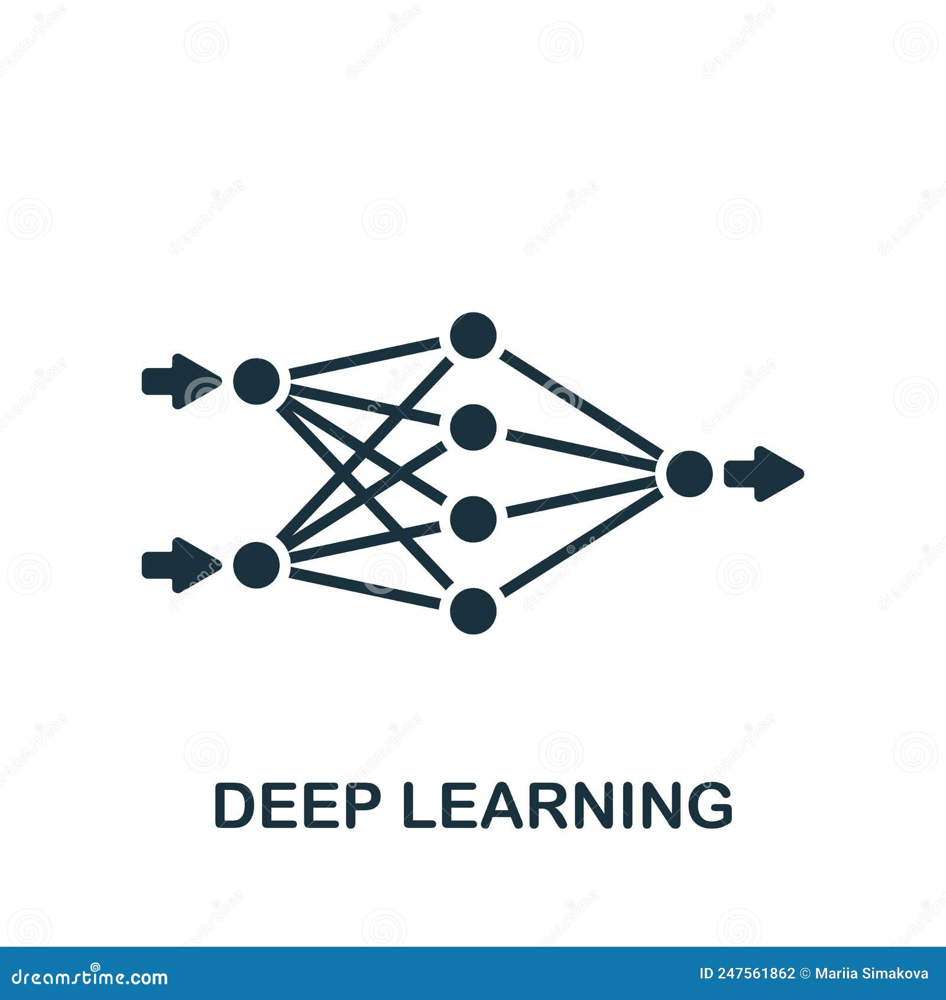
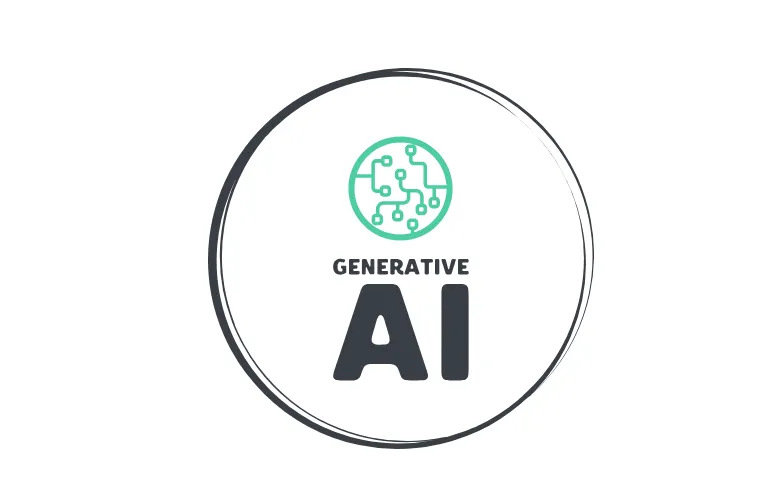

<!-- ===================== PROFILE HEADER ===================== -->
  

  

---

<!-- ===================== LEFT IMAGE + ABOUT ===================== -->
<table>
<tr>
<td width="35%" align="center">

<!-- Replace the image link with your own -->

</td>

<td width="65%">

### 👨‍💻 About Me  

- 🎯 **Aspiring AI/ML Engineer & Tech Enthusiast**
- 💡 Passionate about **Machine Learning, Deep Learning & Web Technologies**
- 🚀 Love building **impact-driven projects**
- 📚 Constant learner, problem solver & explorer  

</td>
</tr>
</table>

---

  

    <h3>🚀 My Tech Stack</h3>
    

      
      
      
      
      
      
      
    

  

---

<!-- ===================== FEATURED PROJECTS ===================== -->
### 🌟 Featured Projects  

  <a href="https://agrovision-wheat.vercel.app/" style="text-decoration: none;">
    <button style="background-color: black; color: white; border: none; border-radius: 30px; padding: 15px 25px; font-size: 16px; font-weight: bold; cursor: pointer; transition: transform 0.3s;">
      AgroVision 🌾 |
    </button>
  </a>

  <a href="https://impact-sense.vercel.app/" style="text-decoration: none;">
    <button style="background-color: black; color: white; border: none; border-radius: 30px; padding: 15px 25px; font-size: 16px; font-weight: bold; cursor: pointer; transition: transform 0.3s;">
      ImpactSense 🌍 |
    </button>
  </a>

  <a href="https://archaeological-site-mapping.vercel.app/" style="text-decoration: none;">
    <button style="background-color: black; color: white; border: none; border-radius: 30px; padding: 15px 25px; font-size: 16px; font-weight: bold; cursor: pointer; transition: transform 0.3s;">
      Archaeological Site Mapping |
    </button>
  </a>

  <a href="https://talaganarajesh.vercel.app/" style="text-decoration: none;">
    <button style="background-color: black; color: white; border: none; border-radius: 30px; padding: 15px 25px; font-size: 16px; font-weight: bold; cursor: pointer; transition: transform 0.3s;">
      My Portfolio 🌐
    </button>
  </a>

---

### 🌐 Connect With Me  

  
  
  

---
### Github Stats

  

  

---

### 📈 GitHub Contribution Activity

  

